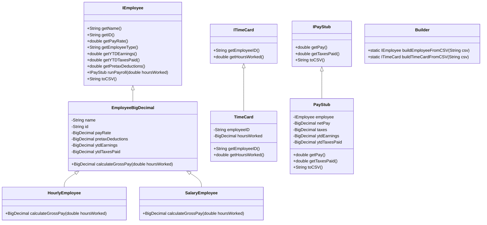
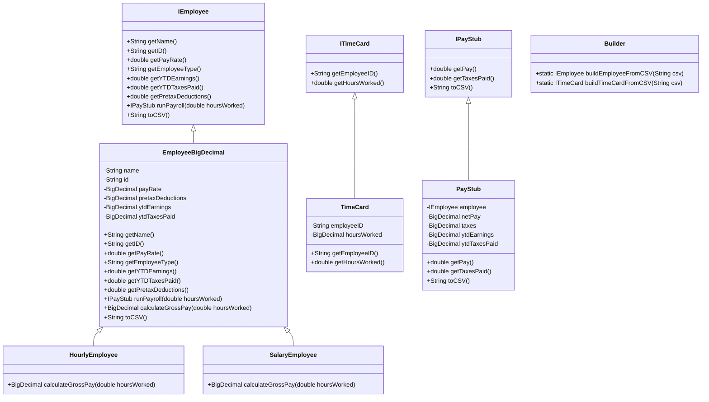

# Payroll Generator Design Document

This document is meant to provide a tool for you to demonstrate the design process. You need to work on this before you code, and after have a finished product. That way you can compare the changes, and changes in design are normal as you work through a project. It is contrary to popular belief, but we are not perfect our first attempt. We need to iterate on our designs to make them better. This document is a tool to help you do that.

## (INITIAL DESIGN): Class Diagram

Place your class diagram below. Make sure you check the fil in the browser on github.com to make sure it is rendering correctly. If it is not, you will need to fix it. As a reminder, here is a link to tools that can help you create a class diagram: [Class Resources: Class Design Tools](https://github.com/CS5004-khoury-lionelle/Resources?tab=readme-ov-file#uml-design-tools)

## (INITIAL DESIGN): Tests to Write - Brainstorm

Write a test (in english) that you can picture for the class diagram you have created. This is the brainstorming stage in the TDD process. 

> [!TIP]
> As a reminder, this is the TDD process we are following:
> 1. Figure out a number of tests by brainstorming (this step)
> 2. Write **one** test
> 3. Write **just enough** code to make that test pass
> 4. Refactor/update  as you go along
> 5. Repeat steps 2-4 until you have all the tests passing/fully built program

You should feel free to number your brainstorm. 

1. Test that the `Employee` class properly returns `name` from `getName()`
2. Test that the `Employee` class properly returns `id` from `getId()`
3. continue to add your brainstorm here (you don't need to super formal - this is a brainstorm) - yes, you can change the bullets above to something that fits your design.

======================================================================================= 
1. Employee Tests

   * Check if an employee’s name and ID are correctly returned.
   * Make sure their pay rate, employee type (hourly or salary), and year-to-date earnings/taxes are accurate.

2. Hourly Employee Tests
   * Ensure regular pay is correctly calculated when working 40 hours or less.
   * Ensure overtime pay (1.5x) is correctly applied when working more than 40 hours.
   * Make sure negative hours throw an error.
   * If the employee worked 0 hours, their pay should be $0.00.

3. Salary Employee Tests
   * Make sure the salary is correctly divided into pay periods (annual salary ÷ 24).
   * The number of hours worked shouldn’t affect salary pay.

4. Pay Stub Tests
   * Ensure the pay stub correctly shows net pay and taxes deducted.
   * Make sure it correctly converts to a CSV format.
   * Throw an error if the pay stub is created with invalid values (e.g., negative pay).

5. Time Card Tests
   * Make sure an employee’s ID and hours worked are correctly recorded.
   * Throw an error if hours worked is negative or if the employee ID is missing.

6. Builder (CSV Parsing) Tests
   * Ensure that valid CSV data creates the correct employee or time card.
   * Throw an error if the CSV format is incorrect or contains invalid values.

## (FINAL DESIGN): Class Diagram

Go through your completed code, and update your class diagram to reflect the final design. Make sure you check the file in the browser on github.com to make sure it is rendering correctly. It is normal that the two diagrams don't match! Rarely (though possible) is your initial design perfect. 

> [!WARNING]
> If you resubmit your assignment for manual grading, this is a section that often needs updating. You should double check with every resubmit to make sure it is up to date.

## (FINAL DESIGN): Reflection/Retrospective

> [!IMPORTANT]
> The value of reflective writing has been highly researched and documented within computer science, from learning new information to showing higher salaries in the workplace. For this next part, we encourage you to take time, and truly focus on your retrospective.

Take time to reflect on how your design has changed. Write in *prose* (i.e. do not bullet point your answers - it matters in how our brain processes the information). Make sure to include what were some major changes, and why you made them. What did you learn from this process? What would you do differently next time? What was the most challenging part of this process? For most students, it will be a paragraph or two. 

======================================================================================= 
This project taught me that design always evolves during development. At first, the class diagram seemed complete, but as I started coding, I realized changes were needed. Making EmployeeBigDecimal an abstract class helped keep HourlyEmployee and SalaryEmployee organized. Adding validation in constructors prevented issues like negative salaries or missing IDs.

Testing was really useful, especially for finding edge cases in Builder when handling CSV input. I didn’t think about missing fields or formatting issues at first, but writing tests helped catch those problems early. If I did this again, I would spend more time refining the initial design before coding. The biggest challenge was ensuring correct financial calculations using BigDecimal, but now I have a better understanding of handling precision in Java. 